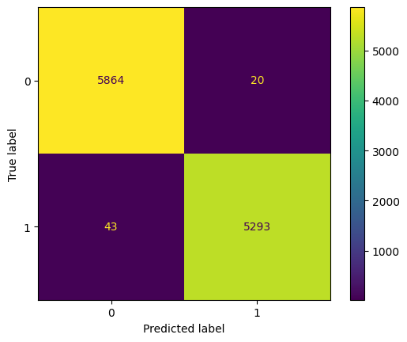
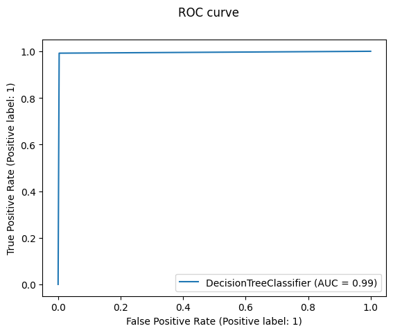

<h1 align="center">Fake News Prediction System</h1>

  

  
  
  
  
  
  
  
  

  

    Badge <a href="https://shields.io/">Source</a>
  

  <h2>Authors</h2>
  <ul>
    <li><a href="https://github.com/luisosorio3214">@luisosorio3214</a></li>
  </ul>

  <h2>Table of Contents</h2>
  <ul>
    <li><a href="#business-problem" target="_parent">Business Problem</a></li>
    <li><a href="#data-source">Data Source</a></li>
    <li><a href="#methods">Methods</a></li>
    <li><a href="#tech-stack">Tech Stack</a></li>
    <li><a href="#nlp">Natural Language Processing</a></li>
    <li><a href="#quick-glance">Quick glance at the Results</a></li>
    <li><a href="#lesson-learned">Lessons learned and Recommendation</a></li>
    <li><a href="#limitation">Limitation and what can be Improved</a></li>
    <li><a href="#local">Run Locally</a></li>
    <li><a href="#notebook">Explore the notebook</a></li>
    <li><a href="#streamlit">Deployment on streamlit</a></li>
    <li><a href="#deployed">App deployed on streamlit</a></li>
    <li><a href="#contribution">Contribution</a></li>
    <li><a href="#license">License</a></li>
  </ul>

  <section id="business-problem">
    <h2>Business Problem</h2>
    

      This app predicts if a news article contains misinformation which can mislead the public and bring social conflicts. In era of technology and social media, fake news has been more of an issue it has become quite difficult to distinguish the validity of the news. The danger of fake news can manipulate people's perception of reality, influence politics, and promote false advertising. This app will predict the probability of the news article of containing fake news. This app is intended for everyone in which the article you reading is in question and want to investigate further before taking anything at face-value. 
    

  </section>

  <section id="data-source">
    <h2>Data Source</h2>
    <ul>
      <li><a href="https://drive.google.com/drive/folders/1UzBdoQFqTJGllGCyodt_ny6x9aTENdGv?usp=share_link">My Google Drive</a></li>
    </ul>
  </section>

  <section id="methods">
    <h2>Methods</h2>
    <ul>
      <li>Exploratory Data Analysis</li>
      <li>Text Cleaning using Regex</li>
      <li>Term Frequency-Inverse Document Frequency</li>
      <li>Modeling</li>
      <li>Deployment</li>
    </ul>
  </section>

  <section id="tech-stack">
    <h2>Tech Stack</h2>
    <ul>
      <li>Python (Refer to requirements.txt for the packages used in this project)</li>
      <li>Streamlit (Interface for model)</li>
      <li>Google Drive (Data Storage)</li>
    </ul>
  </section>

  <section id="nlp">
    <h2>Natural Language Processing</h2>
    

      Since we are given a data frame consisting of observations of articles, in order to implement our machine learning models which only understand numbers we have to figure out how to convert our texts into specific mathematical terms. In other words we must tokenize our words so we are able to extract meaning or a pattern for our specific use case. Recall, the goal is to determine whether an article contains fake news or not thus we should consider tokenizing words rather than sentences since certain words in a article might make an article stand out for containing misinformation. I ended up choosing a vectorizer called TF-IDF (Term Frequency-Inverse Document Frequency) which captures the importance of a word in a document relative to a corpus of documents. Before applying the vectorizer, we clean the text using regex and got rid of special characters or words that provide no special use case in our specific prediction. Now here is a step-by-step explanation on how TF-IDF vectorization works:
      <ol>
        <li>Term Frequency (TF): TF measures the importance of a term within a document. It calculates the frequency of a term (word) in a document divided by the total number of terms in that document. The assumption is that the more frequently a term appears in a document, the more important it is.</li>
        <li>Inverse Document Frequency (IDF): IDF measures the rarity or uniqueness of a term across the entire corpus of documents. It is calculated by taking the total number of documents in the corpus divided by the number of documents that contain the term. IDF assigns higher weights to terms that are less common in the corpus, as they are considered more informative or distinctive.</li>
        <li>TF-IDF Calculation: The TF-IDF score for a term in a document is obtained by multiplying the TF value with the IDF value for that term. This process is repeated for all terms in each document, resulting in a numerical representation of the document based on the importance of its terms relative to the entire corpus.</li>
        <li>Vectorization: After calculating the TF-IDF scores, the TF-IDF vectorizer converts each document into a vector. Each component of the vector represents the TF-IDF score for a specific term in the document.</li>
      </ol>
    

  </section>

  <section id="quick-glance">
    <h2>Quick Glance at the Results</h2>
    

      Confusion Matrix of Decision Tree Classifier.
      

        
      

    

    

      ROC curve of Decision Tree Classifier.
      

        
      

    

    

      Top 3 models on the testing set (with default parameters)
      <table style="width:100%">
        <tr>
          <th>Model</th>
          <th>Accuracy</th>
        </tr>
        <tr>
          <td>Logistic Regression</td>
          <td>98%</td>
        </tr>
        <tr>
          <td>Decision Tree</td>
          <td>99%</td>
        </tr>
        <tr>
          <td>Gradient Boosting</td>
          <td>99%</td>
        </tr>
      </table>
      

      

        <ul>
          <li>Final Model used: Decision Tree Classifier</li>
          <li>Why choose Decision Tree Classifier compared to the other models: I chose Decision Tree compared to gradient boosting since decision tree is the more efficient model. In terms of computation power the gradient boosting was far more expensive since it is actually running multiple decision trees in the background and the accuracy stayed about the same compared to the single decision tree. A good argument was to use Logistic Regression model since we can toy around our metrics and sacrifice a single percent in our accuracy metric. Logistic Regression is also an adequate model for this situation and provides more flexibility, however, it was necessary.  </li>
          <li>Metric used: Accuracy</li>
          <li>Why choose Accuracy as a metric: Now the goal for this project is to correctly identify a false news article, however it is important to keep in mind the consequences of incorrectly identifying a news article as fake, when it actuality it was some real news. In this case we actually want to consider a high specificity rate but then we don't want to have a low metric in recall. Therefore, we want an even balance of both scores so having a good accuracy score would be the best solution. Also its important to note that when our target variable has imbalanced classes, more real articles than fake ones in our case then it is sometimes preferred to use the F1-score metric since we have to take into account the discrepancies the imbalanced classes might contribute to our accuracy. However, in the modeling phase our models actually performed fairly well despite being using unseen data which is why I choose accuracy over F1-score.</li>
        </ul>
      

    

  </section>

  <section id="lesson-learned">
  <h2>Lessons Learned and Recommendation</h2>
  

    <ul>
      <li> This project involved natural language processing and through the process I learned the importance of cleaning the text before the modeling phase. Once I cleaned the text using regex my accuracies improved and therefore the model was more equipped in learning the patterns between the documents. Now every piece of text you encounter will require different cleaning steps and its important to skim through various documents to see what steps must be taken in order to create the most optimal model.</li>
      <li>Another crucial step during the natural language process is picking the adequate algorithm to tokenize the words in the document. This will align with the goal of your project and then appropriate algorithm will tokenize the words in a special manner to achieve that said goal. Some of the most frequently used vectorizer include Count Vectorizer, TF-IDF Vectorizer, Word2Vec, and Bert which all takes words and plots them onto a multi-dimensional space differently hence, the word vectorizer. This is where my well-equipped understanding of Linear Algebra comes into play and helps me better understand each algorithm.</li>
    </ul>
  

  <section id="limitation">
    <h2>Limitation and what can be Improved</h2>
    

      <ul>
        <li>The first big limitation about this project is that our data merely scratches the surface of all the articles available on the internet. In order to create a big model where we actually are able to detect false news articles we would need to scrape most of the articles off the internet and then train our model. That is an awful amount of data, however, I think it will be necessary for the better of our future. All this artificial Intelligence is making it harder to detect misinformation which extends more than news articles and now extending to false audio/videos. We definitely need to build a system that can detect the real ones from the fake to conserve our perception of reality. </li>
        <li>Next time, it might be better if we used our Logistic Regression model and use different metrics to optimize our specific results. We might consider accurately predicting misinformation at the cost of misidentifying some real news articles. Depending on our purpose we can surely investigate this further. </li>
        <li>Another step we can improve or investigate further is our text cleaning phase where we might want to make further adjustments.</li>
        <li>Another huge limitation is language barriers, where our model focused only on english news articles and might not even recognize no other language. This goes to show to make a large scale model it will take a lot of training data and compute power. </li>
      </ul>
    

  </section>

  <section id="local">
    <h2>Run Locally</h2>
    

      First, Open your Command line or Terminal and head to a directory where you want to save the project.
    
    
      <h4>Initialize git</h4>
        <pre>
          <code style="height: 50%;">
          git init
          </code>
        </pre>
      <h4>Clone the Project</h4>
        <pre>
          <code style="height: 50%;">
          git clone https://github.com/luisosorio3214/Fake-News-Prediction-System.git
          </code>
        </pre>
      <h4>Head to project directory</h4>
        <pre>
          <code style="height: 50%;">
          cd Fake-News-Prediction-System
          </code>
        </pre>
      <h4>Create a virtual environment using venv</h4>
        <pre>
          <code style="height: 50%;">
          python -m venv "env_name"
          </code>
        </pre>   
      <h4>Activate virtual environment</h4>
        <pre>
          For Window Users
          <code style="height: 50%;">
          env_name\Scripts\activate
          </code>
          For Mac Users
          <code style="height: 50%;">
          source env_name/bin/activate
          </code>
        </pre>
      <h4>Install required dependencies from requirements.txt file</h4>
        <pre>
          <code style="height: 50%;">
          pip install -r requirements.txt
          </code>
        </pre>
      <h4>Start the streamlit server locally</h4>
        <pre>
          <code style="height: 50%;">
          streamlit run app.py
          </code>
        </pre>
    

    If you are having issues with streamlit, please follow this <a href="https://docs.streamlit.io/library/get-started/installation">tutorial on how to set up streamlit</a>. 
    

  </section>

  <section id="notebook">
  <h2>Explore the notebook</h2>
  

    To explore the notebook file click <a href="https://github.com/luisosorio3214/Fake-News-Prediction-System/blob/main/Fake%20News%20Prediction.ipynb">here</a>.
  

  </section>

  <section id="streamlit">
  <h2>Deployment on streamlit</h2>
  

    To deploy this project on streamlit share, follow these steps:
    <ol>
      <li>Make sure you have a github repository with full project files including the requirements.txt file</li>
      <li>Go to streamlit <a href="https://share.streamlit.io/">share</a></li>
      <li>Login with Github, Google, etc.</li>
      <li>click on new button</li>
      <li>Select the GitHub repo, branch, python file with the streamlit codes</li>
      <li>Click Save and Deploy</li>
    </ol>
  

  </section>

  <section id="deployed">
  <h2>App deployed on Streamlit</h2>
  
  

    Video to gif <a href="https://ezgif.com/">tool</a>
  

  </section>

  <section id="contribution">
    <h2>Contribution</h2>
    

      Pull requests are welcome! For major changes, please open an issue first to discuss what you would like to change or contribute.
    

  </section>

  <section id="license">
    <h2>License</h2>
    

      MIT License    
      Copyright (c) 2022 Stern Semasuka    
      Permission is hereby granted, free of charge, to any person obtaining a copy
      of this software and associated documentation files (the "Software"), to deal
      in the Software without restriction, including without limitation the rights
      to use, copy, modify, merge, publish, distribute, sublicense, and/or sell
      copies of the Software, and to permit persons to whom the Software is
      furnished to do so, subject to the following conditions:    
      The above copyright notice and this permission notice shall be included in all
      copies or substantial portions of the Software.   
      THE SOFTWARE IS PROVIDED "AS IS", WITHOUT WARRANTY OF ANY KIND, EXPRESS OR
      IMPLIED, INCLUDING BUT NOT LIMITED TO THE WARRANTIES OF MERCHANTABILITY,
      FITNESS FOR A PARTICULAR PURPOSE AND NONINFRINGEMENT. IN NO EVENT SHALL THE
      AUTHORS OR COPYRIGHT HOLDERS BE LIABLE FOR ANY CLAIM, DAMAGES OR OTHER
      LIABILITY, WHETHER IN AN ACTION OF CONTRACT, TORT OR OTHERWISE, ARISING FROM,
      OUT OF OR IN CONNECTION WITH THE SOFTWARE OR THE USE OR OTHER DEALINGS IN THE
      SOFTWARE.   
      Learn more about <a href="https://choosealicense.com/licenses/mit/"> MIT </a> license
    

  </section>

